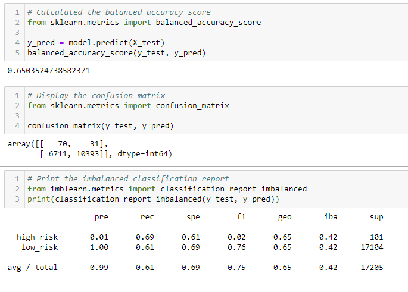
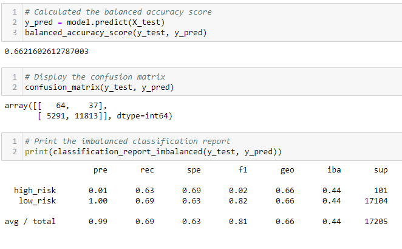
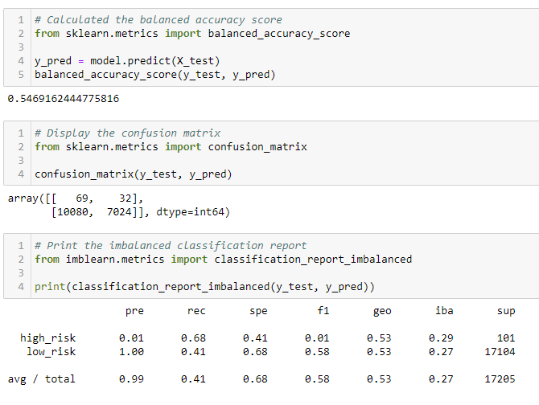
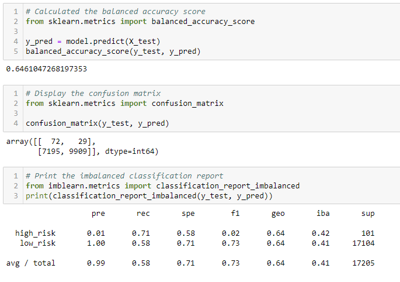
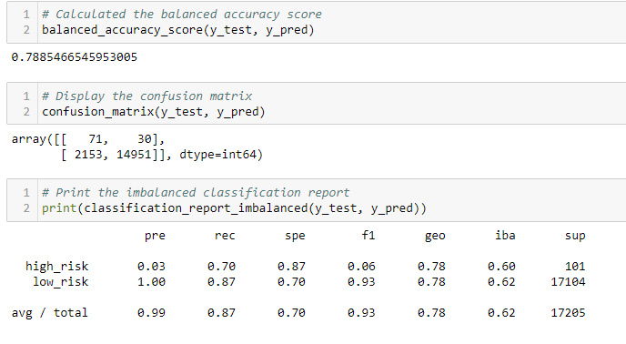
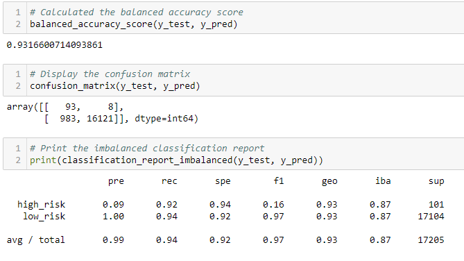

# **Credit Risk Analysis**

## **Overview**
 In this analysis, our goal is to apply machine learning in order to investigate credit card risk. Taking in consideration that the credit risk is an unbalanced classification problem, we are required to use imbalanced-learn and scikit-learn libraries. We will be oversampling the data with RandomOverSampler and SMOTE and undersampling with ClusterCentroids and then comparing the created models by using SMOTEEN. In order to model out the credit risk, we will be using BalancedRandomForestClassifier and EasyEnsembleClassifier.

## **Results**

1. Naive Random Oversampling

Balanced accuracy score Precision and recall scores are illustrated in the image below. 
Based on the results Naive Random Oversampling does not provide very strong credit risk predictions.

2. SMOTE Oversampling

Balanced accuracy score Precision and recall scores are illustrated in the image below. 
Based on the results Smote Oversampling model does not improve the accuracy levels, but it does slightly improve the scores from Naice Random Oversampling. 

3. Cluster Centroids Undersampling

Balanced accuracy score Precision and recall scores are illustrated in the image below. 
Based on the results due to this model using real data points in the dataset, the accuracy level significantly decreases from the oversampling methods.

4. SMOTEENN Combination Sampling

Balanced accuracy score Precision and recall scores are illustrated in the image below. 
Based on the results this model doesn't significantly improve the accuracy levels, it is similar to the Naive Random Oversampling and Smote Oversampling levels 

5. Balanced Random Forest Classifier

Balanced accuracy score Precision and recall scores are illustrated in the image below. 
Based on the results this model increased accuracy over the other models. The level jumped to an 79% accuracy level. While this is higher than the previous models, it is still considered unsuitable for a machine learning model.

6. Easy Ensemble Classifier

Balanced accuracy score Precision and recall scores are illustrated in the image below. 
Based on the results the accuracy level is at 93%. Being the more accurate model out of all six, it is still considered unsuitable for a machine learning model. This model also increased the high risk recall levels.

## **Summary**

Out of all six models presented above, the Easy Ensemble Classifier model is the most precise in comparison to the other five with an accuracy level at 93%. This model does not meet the standards, yet it does help to predict the credit card risk of the data provided. I would recommend the Easy Ensemble Classifier model beucase of the highest accuracy score out of all six. 
